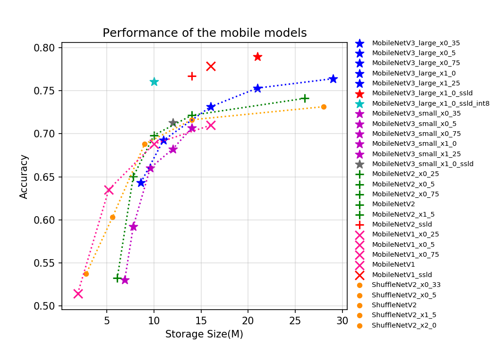
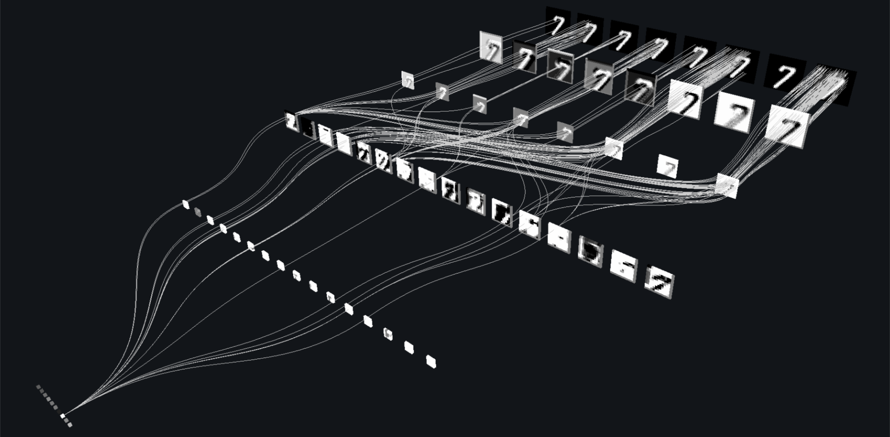
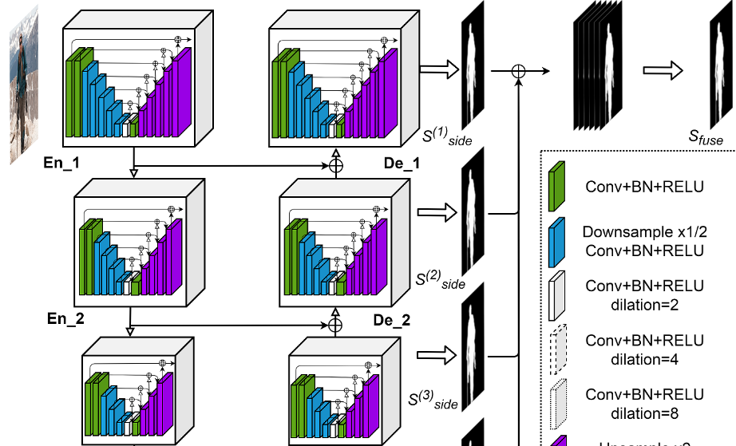
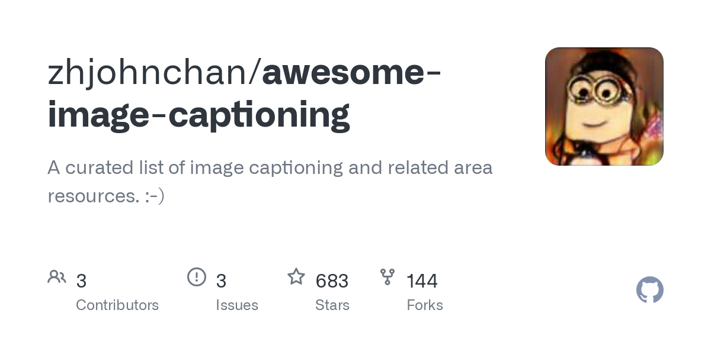
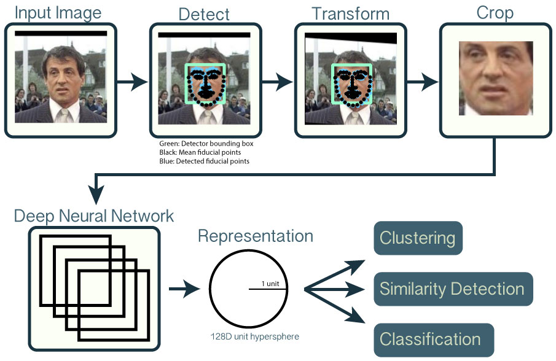
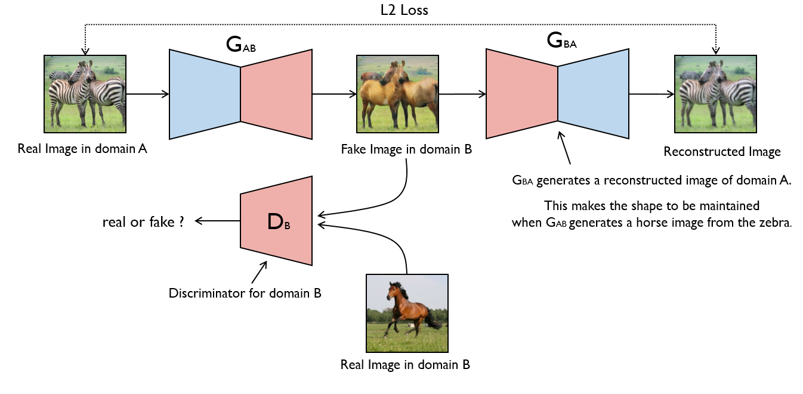
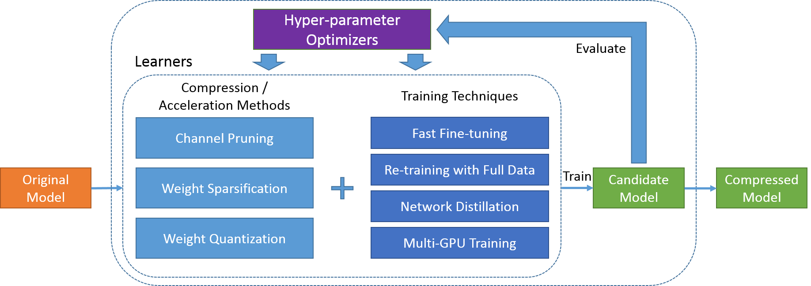

<!-- markdownlint-disable -->
<h1 align="center">
    计算机视觉项目&工具库&资源大全
     
</h1>

    <strong>计算机视觉项目&工具库&资源大全，划分子领域版块汇集梳理，每周自动更新</strong>

    
    
    

本资源清单包含120个计算机视觉相关的项目&工具库&资源，这些资源总共分成12个不同的子板块，这些项目目前在github上已经收到650K个点赞。所有的工具资源每周会自动从GitHub和工具维护平台采集信息，并更新梳理展示。本清单参考[best-of模板](https://github.com/best-of-lists/best-of)完成，欢迎大家提PR丰富本清单。

---

## Contents

- [图像分类](#) _10 projects_
- [目标检测](#) _13 projects_
- [图像分割](#) _8 projects_
- [OCR文字识别](#ocr) _11 projects_
- [图文转换ImageCaptioning与视觉问答VQA](#imagecaptioningvqa) _11 projects_
- [图图转换ImageTranslation](#imagetranslation) _9 projects_
- [图像超分辨率](#) _10 projects_
- [人脸检测与识别](#) _10 projects_
- [医疗影像](#) _7 projects_
- [行人检测](#) _5 projects_
- [自动驾驶](#) _6 projects_
- [生成对抗网络GAN](#gan) _10 projects_
- [模型压缩与优化](#) _9 projects_

 

## 图像分类

<table width="100%"><tr align="center"><td valign="top" width="33.3%">  <h3><a href="https://github.com/rwightman/pytorch-image-models">pytorch-image-models</a></h3>
⭐ 17K · <a href="https://github.com/rwightman/pytorch-image-models">:octocat: Code</a>

rwightman pytorch-image-models

by <a href="https://github.com/rwightman">@rwightman</a>
</td><td valign="top" width="33.3%">  <h3><a href="https://github.com/lucidrains/vit-pytorch">Vision-Transformer</a></h3>
⭐ 9.2K · <a href="https://github.com/lucidrains/vit-pytorch">:octocat: Code</a>

lucidrains vit-pytorch

by <a href="https://github.com/lucidrains">@lucidrains</a>
</td><td valign="top" width="33.3%">  <h3><a href="https://github.com/PaddlePaddle/PaddleClas">PaddlePaddle-PaddleClas</a></h3>
⭐ 3.4K · <a href="https://github.com/PaddlePaddle/PaddleClas">:octocat: Code</a>

PaddlePaddle PaddleClas

by <a href="https://github.com/PaddlePaddle">@PaddlePaddle</a>
</td></tr><tr align="center"><td valign="top" width="33.3%">  <h3><a href="https://github.com/weiaicunzai/awesome-image-classification">awesome-image-classification</a></h3>
⭐ 2.1K · <a href="https://github.com/weiaicunzai/awesome-image-classification">:octocat: Code</a>

weiaicunzai awesome-image-classification

by <a href="https://github.com/weiaicunzai">@weiaicunzai</a>
</td><td valign="top" width="33.3%">  <h3><a href="https://github.com/facebookresearch/pycls">facebookresearch-pycls</a></h3>
⭐ 1.9K · <a href="https://github.com/facebookresearch/pycls">:octocat: Code</a>

facebookresearch pycls

by <a href="https://github.com/facebookresearch">@facebookresearch</a>
</td><td valign="top" width="33.3%">  <h3><a href="https://github.com/rwightman/gen-efficientnet-pytorch">gen-efficientnet-pytorch</a></h3>
⭐ 1.5K · <a href="https://github.com/rwightman/gen-efficientnet-pytorch">:octocat: Code</a>

rwightman gen-efficientnet-pytorch

by <a href="https://github.com/rwightman">@rwightman</a>
</td></tr><tr align="center"><td valign="top" width="33.3%">  <h3><a href="https://github.com/facebookresearch/ClassyVision">facebookresearch-ClassyVision</a></h3>
⭐ 1.4K · <a href="https://github.com/facebookresearch/ClassyVision">:octocat: Code</a>

facebookresearch ClassyVision

by <a href="https://github.com/facebookresearch">@facebookresearch</a>
</td><td valign="top" width="33.3%">  <h3><a href="https://github.com/open-mmlab/mmclassification">open-mmlab-mmclassification</a></h3>
⭐ 1.2K · <a href="https://github.com/open-mmlab/mmclassification">:octocat: Code</a>

open-mmlab mmclassification

by <a href="https://github.com/open-mmlab">@open-mmlab</a>
</td><td valign="top" width="33.3%">  <h3><a href="https://github.com/hysts/pytorch_image_classification">pytorch_image_classification</a></h3>
⭐ 1K · <a href="https://github.com/hysts/pytorch_image_classification">:octocat: Code</a>

hysts pytorch_image_classification

by <a href="https://github.com/hysts">@hysts</a>
</td></tr><tr align="center"><td valign="top" width="33.3%">  <h3><a href="https://github.com/NVIDIA-AI-IOT/tf_to_trt_image_classification">NVIDIA-tf_to_trt_image_classification</a></h3>
⭐ 450 · <a href="https://github.com/NVIDIA-AI-IOT/tf_to_trt_image_classification">:octocat: Code</a>

NVIDIA-AI-IOT tf_to_trt_image_classification

by <a href="https://github.com/NVIDIA-AI-IOT">@NVIDIA-AI-IOT</a>
</td></tr></table>

 

## 目标检测

<table width="100%"><tr align="center"><td valign="top" width="33.3%">  <h3><a href="https://github.com/matterport/Mask_RCNN">matterport-Mask_RCNN</a></h3>
⭐ 21K · <a href="https://github.com/matterport/Mask_RCNN">:octocat: Code</a>

matterport-Mask_RCNN

by <a href="https://github.com/matterport">@matterport</a>
</td><td valign="top" width="33.3%">  <h3><a href="https://github.com/facebookresearch/detectron2">detectron2</a></h3>
⭐ 20K · <a href="https://github.com/facebookresearch/detectron2">:octocat: Code</a>

facebookresearch detectron2

by <a href="https://github.com/facebookresearch">@facebookresearch</a>
</td><td valign="top" width="33.3%">  <h3><a href="https://github.com/open-mmlab/mmdetection">open-mmlab-mmdetection</a></h3>
⭐ 19K · <a href="https://github.com/open-mmlab/mmdetection">:octocat: Code</a>

open-mmlab-mmdetection

by <a href="https://github.com/open-mmlab">@open-mmlab</a>
</td></tr><tr align="center"><td valign="top" width="33.3%">  <h3><a href="https://github.com/tzutalin/labelImg">labelImg</a></h3>
⭐ 17K · <a href="https://github.com/tzutalin/labelImg">:octocat: Code</a>

tzutalin labelImg

by <a href="https://github.com/tzutalin">@tzutalin</a>
</td><td valign="top" width="33.3%">  <h3><a href="https://github.com/hoya012/deep_learning_object_detection">deep_learning_object_detection</a></h3>
⭐ 11K · <a href="https://github.com/hoya012/deep_learning_object_detection">:octocat: Code</a>

hoya012 deep_learning_object_detection

by <a href="https://github.com/hoya012">@hoya012</a>
</td><td valign="top" width="33.3%">  <h3><a href="https://github.com/facebookresearch/detr">facebookresearch-detr</a></h3>
⭐ 8.6K · <a href="https://github.com/facebookresearch/detr">:octocat: Code</a>

facebookresearch detr

by <a href="https://github.com/facebookresearch">@facebookresearch</a>
</td></tr><tr align="center"><td valign="top" width="33.3%">  <h3><a href="https://github.com/PaddlePaddle/PaddleDetection">PaddleDetection</a></h3>
⭐ 6.7K · <a href="https://github.com/PaddlePaddle/PaddleDetection">:octocat: Code</a>

PaddleDetection

by <a href="https://github.com/PaddlePaddle">@PaddlePaddle</a>
</td><td valign="top" width="33.3%">  <h3><a href="https://github.com/xingyizhou/CenterNet">CenterNet</a></h3>
⭐ 6.3K · <a href="https://github.com/xingyizhou/CenterNet">:octocat: Code</a>

xingyizhou-CenterNet

by <a href="https://github.com/xingyizhou">@xingyizhou</a>
</td><td valign="top" width="33.3%">  <h3><a href="https://github.com/xuebinqin/U-2-Net">U-2-Net</a></h3>
⭐ 5.5K · <a href="https://github.com/xuebinqin/U-2-Net">:octocat: Code</a>

xuebinqin-U-2-Net

by <a href="https://github.com/xuebinqin">@xuebinqin</a>
</td></tr><tr align="center"><td valign="top" width="33.3%">  <h3><a href="https://github.com/microsoft/VoTT">microsoft-VoTT</a></h3>
⭐ 3.8K · <a href="https://github.com/microsoft/VoTT">:octocat: Code</a>

microsoft VoTT

by <a href="https://github.com/microsoft">@microsoft</a>
</td><td valign="top" width="33.3%">  <h3><a href="https://github.com/TuSimple/simpledet">TuSimple-simpledet</a></h3>
⭐ 3K · <a href="https://github.com/TuSimple/simpledet">:octocat: Code</a>

TuSimple simpledet

by <a href="https://github.com/TuSimple">@TuSimple</a>
</td><td valign="top" width="33.3%">  <h3><a href="https://github.com/open-mmlab/mmtracking">open-mmlab-mmtracking</a></h3>
⭐ 2.1K · <a href="https://github.com/open-mmlab/mmtracking">:octocat: Code</a>

PaddleDetection

by <a href="https://github.com/open-mmlab">@open-mmlab</a>
</td></tr><tr align="center"><td valign="top" width="33.3%">  <h3><a href="https://github.com/Tencent/ObjectDetection-OneStageDet">ObjectDetection-OneStageDet</a></h3>
⭐ 1.9K · <a href="https://github.com/Tencent/ObjectDetection-OneStageDet">:octocat: Code</a>

Tencent ObjectDetection-OneStageDet

by <a href="https://github.com/Tencent">@Tencent</a>
</td></tr></table>

 

## 图像分割

<table width="100%"><tr align="center"><td valign="top" width="33.3%">  <h3><a href="https://github.com/mrgloom/awesome-semantic-segmentation">awesome-semantic-segmentation</a></h3>
⭐ 9.1K · <a href="https://github.com/mrgloom/awesome-semantic-segmentation">:octocat: Code</a>

awesome-semantic-segmentation

by <a href="https://github.com/mrgloom">@mrgloom</a>
</td><td valign="top" width="33.3%">  <h3><a href="https://github.com/PaddlePaddle/PaddleSeg">PaddleSeg</a></h3>
⭐ 3.9K · <a href="https://github.com/PaddlePaddle/PaddleSeg">:octocat: Code</a>

PaddlePaddle PaddleSeg

by <a href="https://github.com/PaddlePaddle">@PaddlePaddle</a>
</td><td valign="top" width="33.3%">  <h3><a href="https://github.com/open-mmlab/mmsegmentation">openmmlab-mmsegmentation</a></h3>
⭐ 3.5K · <a href="https://github.com/open-mmlab/mmsegmentation">:octocat: Code</a>

openmmlab-mmsegmentation

by <a href="https://github.com/open-mmlab">@open-mmlab</a>
</td></tr><tr align="center"><td valign="top" width="33.3%">  <h3><a href="https://github.com/divamgupta/image-segmentation-keras">image-segmentation-keras</a></h3>
⭐ 2.4K · <a href="https://github.com/divamgupta/image-segmentation-keras">:octocat: Code</a>

divamgupta image-segmentation-keras

by <a href="https://github.com/divamgupta">@divamgupta</a>
</td><td valign="top" width="33.3%">  <h3><a href="https://github.com/LeeJunHyun/Image_Segmentation">Image_Segmentation</a></h3>
⭐ 1.8K · <a href="https://github.com/LeeJunHyun/Image_Segmentation">:octocat: Code</a>

LeeJunHyun Image_Segmentation

by <a href="https://github.com/LeeJunHyun">@LeeJunHyun</a>
</td><td valign="top" width="33.3%">  <h3><a href="https://github.com/MIC-DKFZ/medicaldetectiontoolkit">medical-detection-toolkit</a></h3>
⭐ 1.1K · <a href="https://github.com/MIC-DKFZ/medicaldetectiontoolkit">:octocat: Code</a>

MIC-DKFZ medicaldetectiontoolkit

by <a href="https://github.com/MIC-DKFZ">@MIC-DKFZ</a>
</td></tr><tr align="center"><td valign="top" width="33.3%">  <h3><a href="https://github.com/black0017/MedicalZooPytorch">MedicalZooPytorch</a></h3>
⭐ 950 · <a href="https://github.com/black0017/MedicalZooPytorch">:octocat: Code</a>

black0017-MedicalZooPytorch

by <a href="https://github.com/black0017">@black0017</a>
</td><td valign="top" width="33.3%">  <h3><a href="https://github.com/warmspringwinds/pytorch-segmentation-detection">pytorch-segmentation-detection</a></h3>
⭐ 720 · <a href="https://github.com/warmspringwinds/pytorch-segmentation-detection">:octocat: Code</a>

pytorch-segmentation-detection

by <a href="https://github.com/warmspringwinds">@warmspringwinds</a>
</td></tr></table>

 

## OCR文字识别

<table width="100%"><tr align="center"><td valign="top" width="33.3%">  <h3><a href="https://github.com/tesseract-ocr/tesseract">tesseract</a></h3>
⭐ 45K · <a href="https://github.com/tesseract-ocr/tesseract">:octocat: Code</a>

tesseract-ocr-tesseract

by <a href="https://github.com/tesseract-ocr">@tesseract-ocr</a>
</td><td valign="top" width="33.3%">  <h3><a href="https://github.com/PaddlePaddle/PaddleOCR">PaddleOCR</a></h3>
⭐ 20K · <a href="https://github.com/PaddlePaddle/PaddleOCR">:octocat: Code</a>

PaddlePaddle PaddleOCR

by <a href="https://github.com/PaddlePaddle">@PaddlePaddle</a>
</td><td valign="top" width="33.3%">  <h3><a href="https://github.com/JaidedAI/EasyOCR">EasyOCR</a></h3>
⭐ 14K · <a href="https://github.com/JaidedAI/EasyOCR">:octocat: Code</a>

JaidedAI EasyOCR

by <a href="https://github.com/JaidedAI">@JaidedAI</a>
</td></tr><tr align="center"><td valign="top" width="33.3%">  <h3><a href="https://github.com/DayBreak-u/chineseocr_lite">chineseocr_lite</a></h3>
⭐ 8.7K · <a href="https://github.com/DayBreak-u/chineseocr_lite">:octocat: Code</a>

DayBreak-u chineseocr_lite

by <a href="https://github.com/DayBreak-u">@DayBreak-u</a>
</td><td valign="top" width="33.3%">  <h3><a href="https://github.com/miaomiaosoft/PandaOCR">PandaOCR</a></h3>
⭐ 4.1K · <a href="https://github.com/miaomiaosoft/PandaOCR">:octocat: Code</a>

miaomiaosoft PandaOCR

by <a href="https://github.com/miaomiaosoft">@miaomiaosoft</a>
</td><td valign="top" width="33.3%">  <h3><a href="https://github.com/clovaai/deep-text-recognition-benchmark">deep-text-recognition-benchmark</a></h3>
⭐ 2.8K · <a href="https://github.com/clovaai/deep-text-recognition-benchmark">:octocat: Code</a>

clovaai deep-text-recognition-benchmark

by <a href="https://github.com/clovaai">@clovaai</a>
</td></tr><tr align="center"><td valign="top" width="33.3%">  <h3><a href="https://github.com/xiaofengShi/CHINESE-OCR">CHINESE-OCR</a></h3>
⭐ 2.6K · <a href="https://github.com/xiaofengShi/CHINESE-OCR">:octocat: Code</a>

xiaofengShi CHINESE-OCR

by <a href="https://github.com/xiaofengShi">@xiaofengShi</a>
</td><td valign="top" width="33.3%">  <h3><a href="https://github.com/YCG09/chinese_ocr">chinese_ocr</a></h3>
⭐ 2.5K · <a href="https://github.com/YCG09/chinese_ocr">:octocat: Code</a>

YCG09 chinese_ocr

by <a href="https://github.com/YCG09">@YCG09</a>
</td><td valign="top" width="33.3%">  <h3><a href="https://github.com/kerlomz/captcha_trainer">captcha_trainer</a></h3>
⭐ 2.4K · <a href="https://github.com/kerlomz/captcha_trainer">:octocat: Code</a>

kerlomz captcha_trainer

by <a href="https://github.com/kerlomz">@kerlomz</a>
</td></tr><tr align="center"><td valign="top" width="33.3%">  <h3><a href="https://github.com/ypwhs/captcha_break">captcha_break</a></h3>
⭐ 2.3K · <a href="https://github.com/ypwhs/captcha_break">:octocat: Code</a>

ypwhs captcha_break

by <a href="https://github.com/ypwhs">@ypwhs</a>
</td><td valign="top" width="33.3%">  <h3><a href="https://github.com/ctripcorp/C-OCR">ctrip-OCR</a></h3>
⭐ 2.2K · <a href="https://github.com/ctripcorp/C-OCR">:octocat: Code</a>

ctripcorp C-OCR

by <a href="https://github.com/ctripcorp">@ctripcorp</a>
</td></tr></table>

 

## 图文转换ImageCaptioning与视觉问答VQA

<table width="100%"><tr align="center"><td valign="top" width="33.3%">  <h3><a href="https://github.com/facebookresearch/mmf">facebookresearch-mmf</a></h3>
⭐ 4.9K · <a href="https://github.com/facebookresearch/mmf">:octocat: Code</a>

facebookresearch mmf

by <a href="https://github.com/facebookresearch">@facebookresearch</a>
</td><td valign="top" width="33.3%">  <h3><a href="https://github.com/peteanderson80/bottom-up-attention">bottom-up-attention</a></h3>
⭐ 1.2K · <a href="https://github.com/peteanderson80/bottom-up-attention">:octocat: Code</a>

peteanderson80 bottom-up-attention

by <a href="https://github.com/peteanderson80">@peteanderson80</a>
</td><td valign="top" width="33.3%">  <h3><a href="https://github.com/microsoft/Oscar">microsoft-Oscar</a></h3>
⭐ 820 · <a href="https://github.com/microsoft/Oscar">:octocat: Code</a>

microsoft Oscar

by <a href="https://github.com/microsoft">@microsoft</a>
</td></tr><tr align="center"><td valign="top" width="33.3%">  <h3><a href="https://github.com/zhjohnchan/awesome-image-captioning">awesome-image-captioning</a></h3>
⭐ 790 · <a href="https://github.com/zhjohnchan/awesome-image-captioning">:octocat: Code</a>

zhjohnchan awesome-image-captioning

by <a href="https://github.com/zhjohnchan">@zhjohnchan</a>
</td><td valign="top" width="33.3%">  <h3><a href="https://github.com/jokieleung/awesome-visual-question-answering">awesome-visual-question-answering</a></h3>
⭐ 430 · <a href="https://github.com/jokieleung/awesome-visual-question-answering">:octocat: Code</a>

jokieleung awesome-visual-question-answering

by <a href="https://github.com/jokieleung">@jokieleung</a>
</td><td valign="top" width="33.3%">  <h3><a href="https://github.com/aimagelab/meshed-memory-transformer">meshed-memory-transformer</a></h3>
⭐ 380 · <a href="https://github.com/aimagelab/meshed-memory-transformer">:octocat: Code</a>

aimagelab meshed-memory-transformer

by <a href="https://github.com/aimagelab">@aimagelab</a>
</td></tr><tr align="center"><td valign="top" width="33.3%">  <h3><a href="https://github.com/google-research-datasets/conceptual-captions">conceptual-captions</a></h3>
⭐ 340 · <a href="https://github.com/google-research-datasets/conceptual-captions">:octocat: Code</a>

google-research-datasets conceptual-captions

by <a href="https://github.com/google-research-datasets">@google-research-datasets</a>
</td><td valign="top" width="33.3%">  <h3><a href="https://github.com/forence/Awesome-Visual-Captioning">Awesome-Visual-Captioning</a></h3>
⭐ 310 · <a href="https://github.com/forence/Awesome-Visual-Captioning">:octocat: Code</a>

forence Awesome-Visual-Captioning

by <a href="https://github.com/forence">@forence</a>
</td><td valign="top" width="33.3%">  <h3><a href="https://github.com/MILVLG/openvqa">MILVLG-openvqa</a></h3>
⭐ 260 · <a href="https://github.com/MILVLG/openvqa">:octocat: Code</a>

MILVLG openvqa

by <a href="https://github.com/MILVLG">@MILVLG</a>
</td></tr><tr align="center"><td valign="top" width="33.3%">  <h3><a href="https://github.com/JDAI-CV/image-captioning">image-captioning</a></h3>
⭐ 220 · <a href="https://github.com/JDAI-CV/image-captioning">:octocat: Code</a>

JDAI-CV image-captioning

by <a href="https://github.com/JDAI-CV">@JDAI-CV</a>
</td><td valign="top" width="33.3%">  <h3><a href="https://github.com/dabasajay/Image-Caption-Generator">Image-Caption-Generator</a></h3>
⭐ 170 · <a href="https://github.com/dabasajay/Image-Caption-Generator">:octocat: Code</a>

dabasajay Image-Caption-Generator

by <a href="https://github.com/dabasajay">@dabasajay</a>
</td></tr></table>

 

## 图图转换ImageTranslation

<table width="100%"><tr align="center"><td valign="top" width="33.3%">  <h3><a href="https://github.com/junyanz/pytorch-CycleGAN-and-pix2pix">pytorch-CycleGAN-and-pix2pix</a></h3>
⭐ 17K · <a href="https://github.com/junyanz/pytorch-CycleGAN-and-pix2pix">:octocat: Code</a>

junyanz pytorch-CycleGAN-and-pix2pix

by <a href="https://github.com/junyanz">@junyanz</a>
</td><td valign="top" width="33.3%">  <h3><a href="https://github.com/phillipi/pix2pix">pix2pix</a></h3>
⭐ 8.9K · <a href="https://github.com/phillipi/pix2pix">:octocat: Code</a>

phillipi pix2pix

by <a href="https://github.com/phillipi">@phillipi</a>
</td><td valign="top" width="33.3%">  <h3><a href="https://github.com/NVIDIA/vid2vid">vid2vid</a></h3>
⭐ 7.9K · <a href="https://github.com/NVIDIA/vid2vid">:octocat: Code</a>

NVIDIA vid2vid

by <a href="https://github.com/NVIDIA">@NVIDIA</a>
</td></tr><tr align="center"><td valign="top" width="33.3%">  <h3><a href="https://github.com/taki0112/UGATIT">UGATIT</a></h3>
⭐ 6.1K · <a href="https://github.com/taki0112/UGATIT">:octocat: Code</a>

taki0112 UGATIT

by <a href="https://github.com/taki0112">@taki0112</a>
</td><td valign="top" width="33.3%">  <h3><a href="https://github.com/NVlabs/MUNIT">NVlabs-MUNIT</a></h3>
⭐ 2.4K · <a href="https://github.com/NVlabs/MUNIT">:octocat: Code</a>

NVlabs MUNIT

by <a href="https://github.com/NVlabs">@NVlabs</a>
</td><td valign="top" width="33.3%">  <h3><a href="https://github.com/eladrich/pixel2style2pixel">pixel2style2pixel</a></h3>
⭐ 2.4K · <a href="https://github.com/eladrich/pixel2style2pixel">:octocat: Code</a>

eladrich pixel2style2pixel

by <a href="https://github.com/eladrich">@eladrich</a>
</td></tr><tr align="center"><td valign="top" width="33.3%">  <h3><a href="https://github.com/znxlwm/UGATIT-pytorch">UGATIT-pytorch</a></h3>
⭐ 2.3K · <a href="https://github.com/znxlwm/UGATIT-pytorch">:octocat: Code</a>

znxlwm UGATIT-pytorch

by <a href="https://github.com/znxlwm">@znxlwm</a>
</td><td valign="top" width="33.3%">  <h3><a href="https://github.com/sangwoomo/instagan">instagan</a></h3>
⭐ 820 · <a href="https://github.com/sangwoomo/instagan">:octocat: Code</a>

sangwoomo instagan

by <a href="https://github.com/sangwoomo">@sangwoomo</a>
</td><td valign="top" width="33.3%">  <h3><a href="https://github.com/HsinYingLee/DRIT">DRIT</a></h3>
⭐ 750 · <a href="https://github.com/HsinYingLee/DRIT">:octocat: Code</a>

HsinYingLee DRIT

by <a href="https://github.com/HsinYingLee">@HsinYingLee</a>
</td></tr></table>

 

## 图像超分辨率

<table width="100%"><tr align="center"><td valign="top" width="33.3%">  <h3><a href="https://github.com/nagadomi/waifu2x">waifu2x</a></h3>
⭐ 24K · <a href="https://github.com/nagadomi/waifu2x">:octocat: Code</a>

nagadomi waifu2x

by <a href="https://github.com/nagadomi">@nagadomi</a>
</td><td valign="top" width="33.3%">  <h3><a href="https://github.com/david-gpu/srez">srez</a></h3>
⭐ 5.3K · <a href="https://github.com/david-gpu/srez">:octocat: Code</a>

david-gpu srez

by <a href="https://github.com/david-gpu">@david-gpu</a>
</td><td valign="top" width="33.3%">  <h3><a href="https://github.com/xinntao/ESRGAN">ESRGAN</a></h3>
⭐ 4.1K · <a href="https://github.com/xinntao/ESRGAN">:octocat: Code</a>

xinntao ESRGAN

by <a href="https://github.com/xinntao">@xinntao</a>
</td></tr><tr align="center"><td valign="top" width="33.3%">  <h3><a href="https://github.com/idealo/image-super-resolution">image-super-resolution</a></h3>
⭐ 3.5K · <a href="https://github.com/idealo/image-super-resolution">:octocat: Code</a>

idealo image-super-resolution

by <a href="https://github.com/idealo">@idealo</a>
</td><td valign="top" width="33.3%">  <h3><a href="https://github.com/xinntao/BasicSR">BasicSR</a></h3>
⭐ 3.1K · <a href="https://github.com/xinntao/BasicSR">:octocat: Code</a>

xinntao BasicSR

by <a href="https://github.com/xinntao">@xinntao</a>
</td><td valign="top" width="33.3%">  <h3><a href="https://github.com/tensorlayer/srgan">srgan</a></h3>
⭐ 2.7K · <a href="https://github.com/tensorlayer/srgan">:octocat: Code</a>

tensorlayer srgan

by <a href="https://github.com/tensorlayer">@tensorlayer</a>
</td></tr><tr align="center"><td valign="top" width="33.3%">  <h3><a href="https://github.com/YapengTian/Single-Image-Super-Resolution">Single-Image-Super-Resolution</a></h3>
⭐ 1.7K · <a href="https://github.com/YapengTian/Single-Image-Super-Resolution">:octocat: Code</a>

YapengTian Single-Image-Super-Resolution

by <a href="https://github.com/YapengTian">@YapengTian</a>
</td><td valign="top" width="33.3%">  <h3><a href="https://github.com/LoSealL/VideoSuperResolution">VideoSuperResolution</a></h3>
⭐ 1.3K · <a href="https://github.com/LoSealL/VideoSuperResolution">:octocat: Code</a>

LoSealL VideoSuperResolution

by <a href="https://github.com/LoSealL">@LoSealL</a>
</td><td valign="top" width="33.3%">  <h3><a href="https://github.com/ChaofWang/Awesome-Super-Resolution">Awesome-Super-Resolution</a></h3>
⭐ 1.3K · <a href="https://github.com/ChaofWang/Awesome-Super-Resolution">:octocat: Code</a>

ChaofWang Awesome-Super-Resolution

by <a href="https://github.com/ChaofWang">@ChaofWang</a>
</td></tr><tr align="center"><td valign="top" width="33.3%">  <h3><a href="https://github.com/krasserm/super-resolution">super-resolution</a></h3>
⭐ 1.2K · <a href="https://github.com/krasserm/super-resolution">:octocat: Code</a>

krasserm super-resolution

by <a href="https://github.com/krasserm">@krasserm</a>
</td></tr></table>

 

## 人脸检测与识别

<table width="100%"><tr align="center"><td valign="top" width="33.3%">  <h3><a href="https://github.com/ageitgey/face_recognition">face_recognition</a></h3>
⭐ 44K · <a href="https://github.com/ageitgey/face_recognition">:octocat: Code</a>

ageitgey face_recognition

by <a href="https://github.com/ageitgey">@ageitgey</a>
</td><td valign="top" width="33.3%">  <h3><a href="https://github.com/CMU-Perceptual-Computing-Lab/openpose">openpose</a></h3>
⭐ 24K · <a href="https://github.com/CMU-Perceptual-Computing-Lab/openpose">:octocat: Code</a>

CMU-Perceptual-Computing-Lab openpose

by <a href="https://github.com/CMU-Perceptual-Computing-Lab">@CMU-Perceptual-Computing-Lab</a>
</td><td valign="top" width="33.3%">  <h3><a href="https://github.com/cmusatyalab/openface">openface</a></h3>
⭐ 14K · <a href="https://github.com/cmusatyalab/openface">:octocat: Code</a>

cmusatyalab openface

by <a href="https://github.com/cmusatyalab">@cmusatyalab</a>
</td></tr><tr align="center"><td valign="top" width="33.3%">  <h3><a href="https://github.com/davidsandberg/facenet">facenet</a></h3>
⭐ 12K · <a href="https://github.com/davidsandberg/facenet">:octocat: Code</a>

davidsandberg facenet

by <a href="https://github.com/davidsandberg">@davidsandberg</a>
</td><td valign="top" width="33.3%">  <h3><a href="https://github.com/ShiqiYu/libfacedetection">libfacedetection</a></h3>
⭐ 11K · <a href="https://github.com/ShiqiYu/libfacedetection">:octocat: Code</a>

ShiqiYu libfacedetection

by <a href="https://github.com/ShiqiYu">@ShiqiYu</a>
</td><td valign="top" width="33.3%">  <h3><a href="https://github.com/Linzaer/Ultra-Light-Fast-Generic-Face-Detector-1MB">Ultra-Light-Fast-Generic-Face-Detector-1MB</a></h3>
⭐ 6.3K · <a href="https://github.com/Linzaer/Ultra-Light-Fast-Generic-Face-Detector-1MB">:octocat: Code</a>

Linzaer Ultra-Light-Fast-Generic-Face-Detector-1MB

by <a href="https://github.com/Linzaer">@Linzaer</a>
</td></tr><tr align="center"><td valign="top" width="33.3%">  <h3><a href="https://github.com/ChanChiChoi/awesome-Face_Recognition">awesome-Face_Recognition</a></h3>
⭐ 3.4K · <a href="https://github.com/ChanChiChoi/awesome-Face_Recognition">:octocat: Code</a>

ChanChiChoi awesome-Face_Recognition

by <a href="https://github.com/ChanChiChoi">@ChanChiChoi</a>
</td><td valign="top" width="33.3%">  <h3><a href="https://github.com/timesler/facenet-pytorch">facenet-pytorch</a></h3>
⭐ 2.8K · <a href="https://github.com/timesler/facenet-pytorch">:octocat: Code</a>

timesler facenet-pytorch

by <a href="https://github.com/timesler">@timesler</a>
</td><td valign="top" width="33.3%">  <h3><a href="https://github.com/RiweiChen/DeepFace">DeepFace</a></h3>
⭐ 1.5K · <a href="https://github.com/RiweiChen/DeepFace">:octocat: Code</a>

RiweiChen DeepFace

by <a href="https://github.com/RiweiChen">@RiweiChen</a>
</td></tr><tr align="center"><td valign="top" width="33.3%">  <h3><a href="https://github.com/dlunion/DBFace">DBFace</a></h3>
⭐ 1.2K · <a href="https://github.com/dlunion/DBFace">:octocat: Code</a>

dlunion DBFace

by <a href="https://github.com/dlunion">@dlunion</a>
</td></tr></table>

 

## 医疗影像

<table width="100%"><tr align="center"><td valign="top" width="33.3%">  <h3><a href="https://github.com/xinario/awesome-gan-for-medical-imaging">awesome-gan-for-medical-imaging</a></h3>
⭐ 1.9K · <a href="https://github.com/xinario/awesome-gan-for-medical-imaging">:octocat: Code</a>

xinario awesome-gan-for-medical-imaging

by <a href="https://github.com/xinario">@xinario</a>
</td><td valign="top" width="33.3%">  <h3><a href="https://github.com/albarqouni/Deep-Learning-for-Medical-Applications">Deep-Learning-for-Medical-Applications</a></h3>
⭐ 1.4K · <a href="https://github.com/albarqouni/Deep-Learning-for-Medical-Applications">:octocat: Code</a>

albarqouni Deep-Learning-for-Medical-Applications

by <a href="https://github.com/albarqouni">@albarqouni</a>
</td><td valign="top" width="33.3%">  <h3><a href="https://github.com/sfikas/medical-imaging-datasets">medical-imaging-datasets</a></h3>
⭐ 1.4K · <a href="https://github.com/sfikas/medical-imaging-datasets">:octocat: Code</a>

sfikas medical-imaging-datasets

by <a href="https://github.com/sfikas">@sfikas</a>
</td></tr><tr align="center"><td valign="top" width="33.3%">  <h3><a href="https://github.com/DLTK/DLTK">DLTK</a></h3>
⭐ 1.3K · <a href="https://github.com/DLTK/DLTK">:octocat: Code</a>

DLTK DLTK

by <a href="https://github.com/DLTK">@DLTK</a>
</td><td valign="top" width="33.3%">  <h3><a href="https://github.com/black0017/MedicalZooPytorch">MedicalZoo-Pytorch</a></h3>
⭐ 950 · <a href="https://github.com/black0017/MedicalZooPytorch">:octocat: Code</a>

black0017 MedicalZooPytorch

by <a href="https://github.com/black0017">@black0017</a>
</td><td valign="top" width="33.3%">  <h3><a href="https://github.com/perone/medicaltorch">medicaltorch</a></h3>
⭐ 770 · <a href="https://github.com/perone/medicaltorch">:octocat: Code</a>

perone medicaltorch

by <a href="https://github.com/perone">@perone</a>
</td></tr><tr align="center"><td valign="top" width="33.3%">  <h3><a href="https://github.com/MITK/MITK">MITK</a></h3>
⭐ 470 · <a href="https://github.com/MITK/MITK">:octocat: Code</a>

MITK MITK

by <a href="https://github.com/MITK">@MITK</a>
</td></tr></table>

 

## 行人检测

<table width="100%"><tr align="center"><td valign="top" width="33.3%">  <h3><a href="https://github.com/YonghaoHe/LFFD-A-Light-and-Fast-Face-Detector-for-Edge-Devices">LFFD-A-Light-and-Fast-Face-Detector-for-Edge-Devices</a></h3>
⭐ 1.3K · <a href="https://github.com/YonghaoHe/LFFD-A-Light-and-Fast-Face-Detector-for-Edge-Devices">:octocat: Code</a>

YonghaoHe LFFD-A-Light-and-Fast-Face-Detector-for-Edge-Devices

by <a href="https://github.com/YonghaoHe">@YonghaoHe</a>
</td><td valign="top" width="33.3%">  <h3><a href="https://github.com/hasanirtiza/Pedestron">Pedestron</a></h3>
⭐ 530 · <a href="https://github.com/hasanirtiza/Pedestron">:octocat: Code</a>

hasanirtiza Pedestron

by <a href="https://github.com/hasanirtiza">@hasanirtiza</a>
</td><td valign="top" width="33.3%">  <h3><a href="https://github.com/thatbrguy/Pedestrian-Detection">Pedestrian-Detection</a></h3>
⭐ 340 · <a href="https://github.com/thatbrguy/Pedestrian-Detection">:octocat: Code</a>

thatbrguy Pedestrian-Detection

by <a href="https://github.com/thatbrguy">@thatbrguy</a>
</td></tr><tr align="center"><td valign="top" width="33.3%">  <h3><a href="https://github.com/xingkongliang/Pedestrian-Detection">Pedestrian-Detection-papers</a></h3>
⭐ 250 · <a href="https://github.com/xingkongliang/Pedestrian-Detection">:octocat: Code</a>

xingkongliang Pedestrian-Detection

by <a href="https://github.com/xingkongliang">@xingkongliang</a>
</td><td valign="top" width="33.3%">  <h3><a href="https://github.com/zhangpengpengpeng/PedestrianDetectionSystem">PedestrianDetectionSystem</a></h3>
⭐ 250 · <a href="https://github.com/zhangpengpengpeng/PedestrianDetectionSystem">:octocat: Code</a>

zhangpengpengpeng PedestrianDetectionSystem

by <a href="https://github.com/zhangpengpengpeng">@zhangpengpengpeng</a>
</td></tr></table>

 

## 自动驾驶

<table width="100%"><tr align="center"><td valign="top" width="33.3%">  <h3><a href="https://github.com/ApolloAuto/apollo">apollo</a></h3>
⭐ 20K · <a href="https://github.com/ApolloAuto/apollo">:octocat: Code</a>

ApolloAuto apollo

by <a href="https://github.com/ApolloAuto">@ApolloAuto</a>
</td><td valign="top" width="33.3%">  <h3><a href="https://github.com/carla-simulator/carla">carla</a></h3>
⭐ 7.6K · <a href="https://github.com/carla-simulator/carla">:octocat: Code</a>

carla-simulator carla

by <a href="https://github.com/carla-simulator">@carla-simulator</a>
</td><td valign="top" width="33.3%">  <h3><a href="https://github.com/microsoft/AutonomousDrivingCookbook">AutonomousDrivingCookbook</a></h3>
⭐ 2K · <a href="https://github.com/microsoft/AutonomousDrivingCookbook">:octocat: Code</a>

microsoft AutonomousDrivingCookbook

by <a href="https://github.com/microsoft">@microsoft</a>
</td></tr><tr align="center"><td valign="top" width="33.3%">  <h3><a href="https://github.com/manfreddiaz/awesome-autonomous-vehicles">awesome-autonomous-vehicles</a></h3>
⭐ 1.7K · <a href="https://github.com/manfreddiaz/awesome-autonomous-vehicles">:octocat: Code</a>

manfreddiaz awesome-autonomous-vehicles

by <a href="https://github.com/manfreddiaz">@manfreddiaz</a>
</td><td valign="top" width="33.3%">  <h3><a href="https://github.com/huawei-noah/SMARTS">SMARTS</a></h3>
⭐ 560 · <a href="https://github.com/huawei-noah/SMARTS">:octocat: Code</a>

huawei-noah SMARTS

by <a href="https://github.com/huawei-noah">@huawei-noah</a>
</td><td valign="top" width="33.3%">  <h3><a href="https://github.com/autonomousdrivingkr/Awesome-Autonomous-Driving">Awesome-Autonomous-Driving</a></h3>
⭐ 420 · <a href="https://github.com/autonomousdrivingkr/Awesome-Autonomous-Driving">:octocat: Code</a>

autonomousdrivingkr Awesome-Autonomous-Driving

by <a href="https://github.com/autonomousdrivingkr">@autonomousdrivingkr</a>
</td></tr></table>

 

## 生成对抗网络GAN

<table width="100%"><tr align="center"><td valign="top" width="33.3%">  <h3><a href="https://github.com/hindupuravinash/the-gan-zoo">the-gan-zoo</a></h3>
⭐ 12K · <a href="https://github.com/hindupuravinash/the-gan-zoo">:octocat: Code</a>

hindupuravinash the-gan-zoo

by <a href="https://github.com/hindupuravinash">@hindupuravinash</a>
</td><td valign="top" width="33.3%">  <h3><a href="https://github.com/eriklindernoren/PyTorch-GAN">PyTorch-GAN</a></h3>
⭐ 12K · <a href="https://github.com/eriklindernoren/PyTorch-GAN">:octocat: Code</a>

eriklindernoren PyTorch-GAN

by <a href="https://github.com/eriklindernoren">@eriklindernoren</a>
</td><td valign="top" width="33.3%">  <h3><a href="https://github.com/soumith/ganhacks">ganhacks</a></h3>
⭐ 10K · <a href="https://github.com/soumith/ganhacks">:octocat: Code</a>

soumith ganhacks

by <a href="https://github.com/soumith">@soumith</a>
</td></tr><tr align="center"><td valign="top" width="33.3%">  <h3><a href="https://github.com/eriklindernoren/Keras-GAN">Keras-GAN</a></h3>
⭐ 8.6K · <a href="https://github.com/eriklindernoren/Keras-GAN">:octocat: Code</a>

eriklindernoren Keras-GAN

by <a href="https://github.com/eriklindernoren">@eriklindernoren</a>
</td><td valign="top" width="33.3%">  <h3><a href="https://github.com/PaddlePaddle/PaddleGAN">PaddleGAN</a></h3>
⭐ 5.6K · <a href="https://github.com/PaddlePaddle/PaddleGAN">:octocat: Code</a>

PaddlePaddle PaddleGAN

by <a href="https://github.com/PaddlePaddle">@PaddlePaddle</a>
</td><td valign="top" width="33.3%">  <h3><a href="https://github.com/nashory/gans-awesome-applications">gans-awesome-applications</a></h3>
⭐ 4.1K · <a href="https://github.com/nashory/gans-awesome-applications">:octocat: Code</a>

nashory gans-awesome-applications

by <a href="https://github.com/nashory">@nashory</a>
</td></tr><tr align="center"><td valign="top" width="33.3%">  <h3><a href="https://github.com/hwalsuklee/tensorflow-generative-model-collections">tensorflow-generative-model-collections</a></h3>
⭐ 3.8K · <a href="https://github.com/hwalsuklee/tensorflow-generative-model-collections">:octocat: Code</a>

hwalsuklee tensorflow-generative-model-collections

by <a href="https://github.com/hwalsuklee">@hwalsuklee</a>
</td><td valign="top" width="33.3%">  <h3><a href="https://github.com/nightrome/really-awesome-gan">really-awesome-gan</a></h3>
⭐ 3.4K · <a href="https://github.com/nightrome/really-awesome-gan">:octocat: Code</a>

nightrome really-awesome-gan

by <a href="https://github.com/nightrome">@nightrome</a>
</td><td valign="top" width="33.3%">  <h3><a href="https://github.com/znxlwm/pytorch-generative-model-collections">pytorch-generative-model-collections</a></h3>
⭐ 2.3K · <a href="https://github.com/znxlwm/pytorch-generative-model-collections">:octocat: Code</a>

znxlwm pytorch-generative-model-collections

by <a href="https://github.com/znxlwm">@znxlwm</a>
</td></tr><tr align="center"><td valign="top" width="33.3%">  <h3><a href="https://github.com/facebookresearch/pytorch_GAN_zoo">pytorch_GAN_zoo</a></h3>
⭐ 1.4K · <a href="https://github.com/facebookresearch/pytorch_GAN_zoo">:octocat: Code</a>

facebookresearch pytorch_GAN_zoo

by <a href="https://github.com/facebookresearch">@facebookresearch</a>
</td></tr></table>

 

## 模型压缩与优化

<table width="100%"><tr align="center"><td valign="top" width="33.3%">  <h3><a href="https://github.com/microsoft/nni">nni</a></h3>
⭐ 11K · <a href="https://github.com/microsoft/nni">:octocat: Code</a>

microsoft nni

by <a href="https://github.com/microsoft">@microsoft</a>
</td><td valign="top" width="33.3%">  <h3><a href="https://github.com/Tencent/TNN">TNN</a></h3>
⭐ 3.4K · <a href="https://github.com/Tencent/TNN">:octocat: Code</a>

Tencent TNN

by <a href="https://github.com/Tencent">@Tencent</a>
</td><td valign="top" width="33.3%">  <h3><a href="https://github.com/Tencent/PocketFlow">PocketFlow</a></h3>
⭐ 2.7K · <a href="https://github.com/Tencent/PocketFlow">:octocat: Code</a>

Tencent PocketFlow

by <a href="https://github.com/Tencent">@Tencent</a>
</td></tr><tr align="center"><td valign="top" width="33.3%">  <h3><a href="https://github.com/666DZY666/micronet">micronet</a></h3>
⭐ 1.7K · <a href="https://github.com/666DZY666/micronet">:octocat: Code</a>

666DZY666 micronet

by <a href="https://github.com/666DZY666">@666DZY666</a>
</td><td valign="top" width="33.3%">  <h3><a href="https://github.com/tensorflow/model-optimization">model-optimization</a></h3>
⭐ 1.2K · <a href="https://github.com/tensorflow/model-optimization">:octocat: Code</a>

tensorflow model-optimization

by <a href="https://github.com/tensorflow">@tensorflow</a>
</td><td valign="top" width="33.3%">  <h3><a href="https://github.com/quic/aimet">aimet</a></h3>
⭐ 930 · <a href="https://github.com/quic/aimet">:octocat: Code</a>

quic aimet

by <a href="https://github.com/quic">@quic</a>
</td></tr><tr align="center"><td valign="top" width="33.3%">  <h3><a href="https://github.com/PaddlePaddle/PaddleSlim">PaddleSlim</a></h3>
⭐ 870 · <a href="https://github.com/PaddlePaddle/PaddleSlim">:octocat: Code</a>

PaddlePaddle PaddleSlim

by <a href="https://github.com/PaddlePaddle">@PaddlePaddle</a>
</td><td valign="top" width="33.3%">  <h3><a href="https://github.com/memoiry/Awesome-model-compression-and-acceleration">Awesome-model-compression-and-acceleration</a></h3>
⭐ 580 · <a href="https://github.com/memoiry/Awesome-model-compression-and-acceleration">:octocat: Code</a>

memoiry Awesome-model-compression-and-acceleration

by <a href="https://github.com/memoiry">@memoiry</a>
</td><td valign="top" width="33.3%">  <h3><a href="https://github.com/huawei-noah/Data-Efficient-Model-Compression">Data-Efficient-Model-Compression</a></h3>
⭐ 470 · <a href="https://github.com/huawei-noah/Efficient-Computing">:octocat: Code</a>

huawei-noah Data-Efficient-Model-Compression

by <a href="https://github.com/huawei-noah">@huawei-noah</a>
</td></tr></table>

